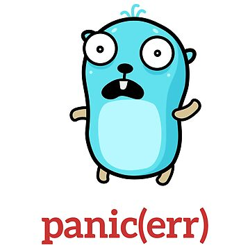
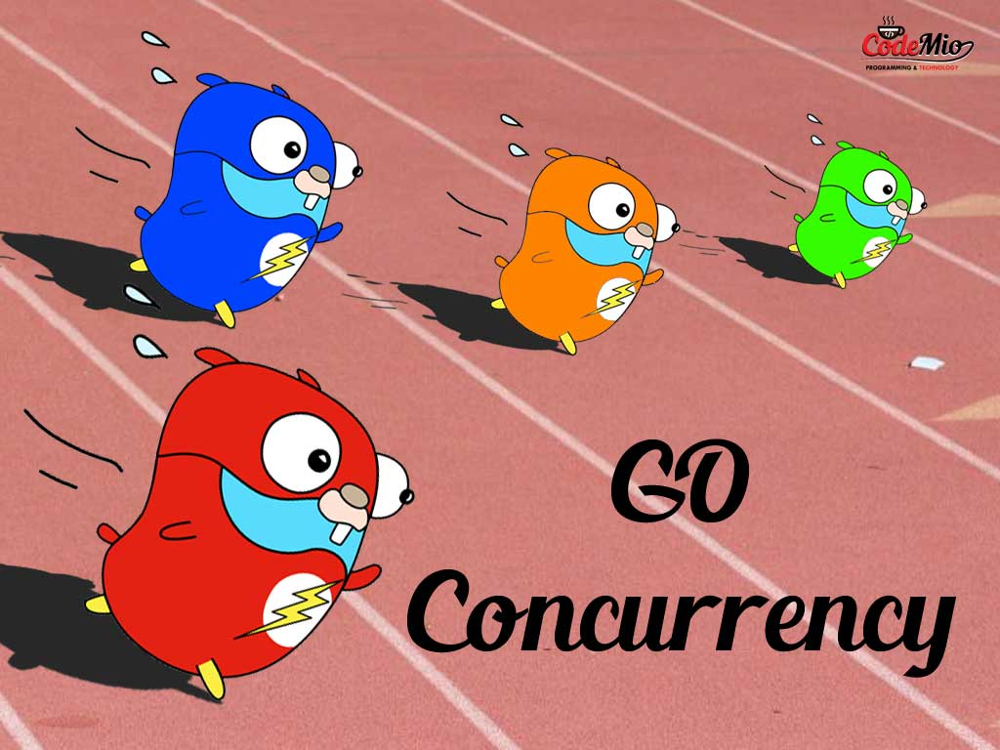
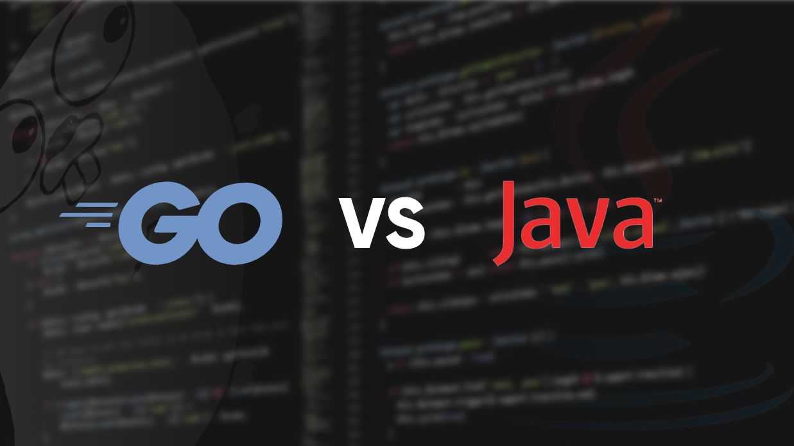

# Let's GO


### Introduzione

In questo progetto si trova una raccolta di esempi di base per essere introdotti al linguaggio GO
in particolare la divisione per package è per argomenti e gli argomenti trattati sono

- array
- cicli
- directories
- errorHandling
- files
- interfaces
- mappe
- puntatori
- strutture
- concorrenza

L'idea e' quella di raccogliere definizioni e esempi pratici per chi si avvicina a GO.


### Elenco di tutte le keywords di GO

| Keyword     | Descrizione                                                                                           |
|-------------|-------------------------------------------------------------------------------------------------------|
| `break`     | Termina l'esecuzione del ciclo più interno o del blocco `switch`.                                      |
| `case`      | Utilizzata in dichiarazioni `switch` per specificare un blocco di codice da eseguire per un caso.      |
| `chan`      | Utilizzata per dichiarare un canale, che permette la comunicazione tra goroutines.                    |
| `const`     | Utilizzata per dichiarare costanti, valori che non possono essere modificati.                         |
| `continue`  | Passa all'iterazione successiva del ciclo più interno.                                                |
| `default`   | Specifica il blocco di codice da eseguire se nessun caso in un `switch` è soddisfatto.                |
| `defer`     | Differisce l'esecuzione di una funzione fino al termine della funzione contenente.                    |
| `else`      | Specifica un blocco di codice da eseguire se la condizione in un `if` non è soddisfatta.              |
| `fallthrough` | Passa l'esecuzione al blocco del caso successivo in una dichiarazione `switch`.                     |
| `for`       | Inizia un ciclo, simile a `while` o `for` in altri linguaggi.                                         |
| `func`      | Definisce una funzione.                                                                               |
| `go`        | Avvia una nuova goroutine.                                                                            |
| `goto`      | Trasferisce il controllo a un'etichetta specificata nel codice.                                       |
| `if`        | Inizia una dichiarazione condizionale.                                                               |
| `import`    | Include pacchetti esterni nel programma.                                                             |
| `interface` | Dichiara un insieme di metodi che un tipo deve implementare.                                          |
| `map`       | Dichiara una mappa, una collezione di coppie chiave/valore.                                           |
| `package`   | Specifica il pacchetto a cui appartiene il file sorgente.                                             |
| `range`     | Itera su elementi di array, slice, mappe, stringhe o canali.                                          |
| `return`    | Termina l'esecuzione di una funzione e opzionalmente restituisce uno o più valori.                    |
| `select`    | Permette di eseguire operazioni di invio o ricezione su più canali.                                   |
| `struct`    | Definisce un tipo di dato aggregato composto da campi.                                                |
| `switch`    | Inizia un blocco di codice condizionale multi-caso.                                                   |
| `type`      | Dichiara un nuovo tipo di dato o crea un alias per un tipo esistente.                                 |
| `var`       | Dichiara una o più variabili e opzionalmente le inizializza.                                          |


### Moduli Definizione

- Un modulo è una collezione di pacchetti (packages) che vengono distribuiti insieme, permettendo una migliore gestione delle versioni del software.
- Un modulo è definito da un file `go.mod` nella directory radice del modulo.
- Il file `go.mod` elenca la versione di Go e le dipendenze del modulo.

### Come creare un nuovo modulo?

Per creare un nuovo modulo, esegui il seguente comando:

```sh
go mod init miomodulo
```
Questo comando creerà un nuovo file go.mod nella directory corrente con il seguente contenuto:

```text
module miomodulo
go 1.20
```
Il file go.mod identifica la directory come radice del modulo.

### Scaricare dipendenze
Per scaricare una dipendenza, utilizza il comando:

```sh
go get github.com/gin-gonic/gin
```

Per rimuovere dipendenze non utilizzate e aggiornare il file go.mod, esegui:

```sh
go mod tidy

```

### File go.mod e go.sum Cosa sono??

- go.sum : contiene le somme di controllo crittografiche delle versioni esatte di ogni modulo di cui il nostro progetto dipende, garantisce che le  future installazioni siano esattamente le stesse cosi da non avere modifiche inattese ee percio' non e' consigliato modificare a mano questo file   
- go.mod : ci permette di gestire le versioni delle nostre dipendemnze.. 

`go get` aggiorna anche il file go.sum
`go mod tidy` rimuove tutte le dipendenze non necessarie dal file go.mod


### Occhio agli errori nelle importazioni uno dei piu comuni 

- Importazione Ciclica, se uno o piu' pacchetti si importano a vicenda


```sh
go build
```
Il comando go build compila i pacchetti Go specificati nei file sorgente e crea un eseguibile.

Esempio di utilizzo:

```sh
go build main.go
```
Questo comando compila il file sorgente main.go e genera un file eseguibile chiamato main (o main.exe su Windows) nella stessa directory. Puoi eseguire l'applicazione digitando ./main nel terminale.

Nota: go build non produce alcun output se la compilazione ha successo. Se si verificano errori di compilazione, verranno stampati nel terminale.

### Test Unitari sui metodi 

```bash
go test
```
Il comando go test esegue test sul codice scritto in Go. Go ha un pacchetto di testing nativo chiamato testing, che fornisce funzionalità per scrivere test unitari e benchmark.

Esempio di test unitario per una funzione Add che somma due numeri:

```go

package main

import "testing"

func Add(a int, b int) int {
    return a + b
}

func TestAdd(t *testing.T) {
    result := Add(1, 2)
    if result != 3 {
        t.Errorf("Add(1, 2) = %d; want 3", result)
    }
}
```
Per eseguire questo test, utilizza il comando:

```sh
go test
```
Questo comando eseguirà tutti i test nel pacchetto corrente. Se il test ha successo, vedrai un output simile a:

```text
PASS
ok  	myapp	0.002s
```
Se il test fallisce, go test mostrerà un messaggio di errore:

```text
--- FAIL: TestAdd (0.00s)
main_test.go:10: Add(1, 2) = 4; want 3
FAIL
exit status 1
FAIL	myapp	0.002s
```

È possibile eseguire test specifici passando il loro nome al comando go test con l'opzione -run. Ad esempio, go test -run TestAdd eseguirà solo il test TestAdd.


### Gestione degli Errori

La gestione degli errori è importante. Il design e le convenzioni del linguaggio Go incoraggiano a verificare esplicitamente gli errori nel punto in cui si verificano, a differenza di altre convenzioni linguistiche che utilizzano il lancio di eccezioni e la loro gestione (catching). In alcuni casi, questo può rendere il codice Go più verboso, ma fortunatamente esistono alcune tecniche che possono essere utilizzate per ridurre la ripetitività nella gestione degli errori.

Ecco alcune tecniche per minimizzare la gestione ripetitiva degli errori:

- **Funzioni Helper**: Creare funzioni helper per la gestione degli errori comuni.
- **Pacchetti di Terze Parti**: Utilizzare pacchetti che semplificano la gestione degli errori.
- **Utilizzo di Defer**: Utilizzare la keyword `defer` per assicurarsi che determinate operazioni vengano eseguite, come la chiusura di file o connessioni.

È essenziale adottare queste tecniche per mantenere il codice Go pulito ed efficiente, garantendo allo stesso tempo una gestione robusta degli errori.



### CONCORRENZA - PARALLELISMO, pecurialità di GO

La concorrenza è un termine utilizzato in informatica per descrivere l'esecuzione di più task che possono essere gestiti in ordine indipendente. Si riferisce all'abilità di un programma di gestire più task in un ordine indipendente.

Immagina di dover eseguire diverse operazioni che richiedono molto tempo, come l'accesso a un database o il download di file da internet. Se eseguissi queste operazioni una alla volta, il programma sarebbe lento e inefficiente. Con la concorrenza, possiamo avviare più operazioni simultaneamente. Nota che questo non implica necessariamente che i task vengano eseguiti nello stesso momento, ma rende il programma più veloce ed efficiente.

A volte la concorrenza viene erroneamente scambiata con il parallelismo. Ad esempio, un singolo thread potrebbe gestire la concorrenza attraverso tecniche come il time slicing, ovvero eseguendo una parte di un task, interrompendosi per eseguire una parte di un altro task, e così via.

Il parallelismo, invece, riguarda l'esecuzione simultanea di più task.

### MODELLO DI CONCORRENZA DI GO: CSP

Tony Hoare nel 1978 : Definisce il CSP 
**Communicating Sequential Process (CSP)** è un modello che permette a due o più processi indipendenti di comunicare tra loro attraverso dei canali.

- In termini piu semplici il CSP è un modello che permette a due o piu' processi indipendenti di comunicare tra loro attraverso dei canali

> Non comunicare facendo condividere la memoria; condividi la memoria comunicando

I Processi indipendenti sono chiamati goroutines e i canali sono utilizzati per comunicare tra queste goroutines
Questa comuinicazione è sicura per la concorrenza, il che significa che 2 go-routines possono accedere in modo sicuro alla stessa variabile di memoria attraverso un canale
Significa che due go routines possono accedre in modok sicuro alla stessa variabile
Una carattersitica chiave del modello CSP in GO è che i canali non solo trasportano i dati, ma anche il cotnrollo
quindi quando una GO routine invia un dato ad un'altra goRoutine atrtaverso un canale
La goRoutine riceve sia i dati sia il controllo
Quindi questa sincronizzazione fa parte del design di GO e permette anche di evitare molte altre difficoltà

### Cosa sono le GO-routines?
Una goroutine è un thread leggero gestito dal runtime di Go.\
Un thread è la più piccola unità di elaborazione che può essere gestita dal sistema operativo. Le goroutines sono simili ai thread ma richiedono meno risorse e sono gestite dal runtime di Go invece che direttamente dal sistema operativo. Questo significa che le goroutines sono molto più efficienti e scalabili, permettendo di creare migliaia o addirittura milioni di goroutines in una singola applicazione.

Il runtime di Go si occupa di gestire la pianificazione delle goroutines su uno o più thread di sistema. Questo approccio consente di sfruttare al meglio le risorse del sistema, mantenendo l'overhead di gestione molto basso rispetto ai thread tradizionali.

Come avviare una goroutine?
Per avviare una goroutine, utilizziamo la parola chiave go seguita dalla funzione che desideriamo eseguire in modo concorrente. Ecco un esempio:


```go
package main

import (
    "fmt"
    "time"
)

func myFunction() {
    fmt.Println("Esecuzione di myFunction in una goroutine")
}

func main() {
    go myFunction() // Avvia myFunction come goroutine
    time.Sleep(time.Second) // Attendi che la goroutine termini (solo per esempio)
    fmt.Println("Main function terminata")
}
```
attenzione: Se il main termina tutte le go-routines vengono chiuse a prescindere se hanno finito oppure no.

### Pacchetto Sync

Il pacchetto `sync` fornisce importanti strumenti per la sincronizzazione delle go-routines. Due di questi strumenti sono `WaitGroup` e `Mutex`.

Il pacchetto `sync` di Go, insieme ai canali, aggiunge orchestrazione alle goroutine. Utilizziamo `sync.Mutex`, `sync.WaitGroup` e una variabile strutturata chiamata `shutdownChannel` per l'orchestrazione, il segnalamento e l'arresto delle goroutine.

Un'importante nota dal manuale di Go riguardo `sync.Mutex` e `sync.WaitGroup`:

> I valori contenenti i tipi definiti in questo pacchetto non dovrebbero essere copiati.

Tradotto per chi non usa Go, C o C++ quotidianamente: le strutture sono passate per valore. Ogni volta che si crea un `Mutex` o un `WaitGroup`, è necessario utilizzare un puntatore, non un valore diretto. Anche se non è sempre necessario, se non si è sicuri di quando sia buono e quando no, è meglio usare sempre i puntatori.


#### WaitGroup

`WaitGroup` viene utilizzato per attendere il completamento di un insieme di go-routines. Le principali funzioni utilizzate con `WaitGroup` sono:

- `Done()`: Viene chiamata quando una goroutine ha terminato il suo lavoro.
- `Wait()`: Blocca l'esecuzione finché tutte le go-routines non hanno terminato.

#### Mutex

Prima di approfondire l'uso del `Mutex`, è importante comprendere il concetto di condizioni di gara (race conditions).

##### Condizioni di Gara

Le condizioni di gara si verificano quando due o più thread possono accedere e manipolare una variabile condivisa contemporaneamente. Ad esempio, supponiamo che due thread debbano accedere a una variabile condivisa `count`.

1. Il thread A legge il valore di `count` (supponiamo sia 0) e lo incrementa a 1.
2. Contemporaneamente, il thread B legge il valore di `count`, che crede sia ancora 0, e lo incrementa a 1.
3. Ora entrambi i thread scrivono il valore calcolato (1) in `count`.

Questo può portare a bug molto sottili e difficili da individuare. Per gestire questi problemi, è necessario utilizzare strumenti di sincronizzazione come il `Mutex`.

##### Mutex - Mutual Exclusion

`Mutex` è uno strumento di sincronizzazione che permette di gestire l'accesso a una risorsa condivisa, garantendo che solo un thread alla volta possa accedere alla risorsa. Utilizzando `Mutex`, possiamo evitare le condizioni di gara e garantire l'integrità dei dati condivisi.

Utilizzare correttamente `WaitGroup` e `Mutex` è essenziale per scrivere programmi concorrenti in modo sicuro ed efficiente.

Un Mutex è un meccanismo di sincronizzazione utilizzato per prevenire l'accesso simultaneo a una risorsa condivisa da più goroutines, evitando così condizioni di gara.

- `mutex.Lock()`: Utilizzato per acquisire il lock. Se il lock è già detenuto da un'altra goroutine, `mutex.Lock()` blocca la goroutine chiamante fino a quando il lock non viene rilasciato.
- `mutex.Unlock()`: Utilizzato per rilasciare il lock dopo aver completato l'elaborazione della risorsa condivisa, permettendo così ad altre goroutines di accedere alla risorsa.

Ecco un esempio che illustra l'uso di `mutex.Lock()` e `mutex.Unlock()`:

```go
var mutex sync.Mutex
var counter int

func incrementCounter() {
    mutex.Lock()
    counter++
    mutex.Unlock()
}
```
Nell'esempio sopra, incrementCounter() è una funzione che incrementa una variabile globale counter. Prima di incrementare counter, acquisisce il lock con mutex.Lock().
Dopo aver incrementato counter, rilascia il lock con mutex.Unlock().
Questo assicura che, anche se incrementCounter() viene chiamata da più goroutines simultaneamente, counter venga incrementato in modo sicuro senza condizioni di gara.


`goRoutines Orfane o Leaked:` sono goRoutines che continuano a eseguiris senza che il programma principale abbia un modo per interromperle o per comunicare con esse.
ogni goRoutine lanciata deve avere un modo chiaro e pulito per terminarla!!!!

### Channels

Pensali come tubi attraverso i quali le GoRoutines si inviano messaggi
`<-`
li creo tramite il make

```go
ch := make(chan int) // creo un canale di Interi
ch <- 5             // Invio di un intero al canale
i := <-ch           // Ricezione di un intero al canale
```

Esempio di codice che mostra creazione, invio ricezione dati attraverso un canale:

ce una funzione worker che simula un lavoro impiega del tempo e una volta finito invia un msg al canale
nella main Creo un canale chiamato messages e avvio la go Routine worker
una volta terminato il suo lavoro la go Routine invia il messaggio e lo ricevo 
con msg := <- messages e poi lo stampo..

```go
func worker(msg string, ch chan string){
    time.Sleep(time.Second * 1)
    ch <- msg
}

func main(){
	messages := make(chan string)
	
	go worker("lavoro completato",messages)
	msg := <- messages
	fmt.Println(msg)
}

```

I canali in Golang sono eccellenti strumenti per il passaggio di messaggi unidirezionali. Li utilizziamo nel nostro codice agente per il passaggio di messaggi, la trasmissione di messaggi e le code di lavoro. Non devono essere chiusi, vengono automaticamente puliti dal garbage collector e sono semplici da creare:
È possibile inviare qualsiasi cosa attraverso quel canale. Si possono creare canali sincroni, asincroni o con più lettori che ascoltano quei canali e fanno qualcosa con i dati.

A differenza delle code, un canale può essere utilizzato per trasmettere un messaggio. Il messaggio più comune che trasmettiamo nel nostro codice è il segnale di spegnimento. Quando è il momento di spegnere, segnaliamo a tutte le goroutine in background che è ora di ripulire. 
<br>C'è un solo modo per segnalare a più ascoltatori un singolo messaggio utilizzando un canale: è necessario chiudere il canale
la funzionalità select in Go. Ci permette di essere reattivi alle interruzioni mentre continuiamo a svolgere lavori importanti. La utilizziamo in modo abbastanza liberale per gestire segnali di spegnimento e timer  per leggere da più flussi di dati e per lavorare con il pacchetto fsnotify di Go.

In go i canali possono essere

- Bufferizzati : Puo' contenere piu valori fino a raggiungere la sua capacita' max e quindi la go-Rout non si blocca
- Non Bufferizzati : Puo' contenere un solo valore alla volta

```go
ch := make(chan int) // NON Bufferizzato
chBuffered := make(chan int,3) // Bufferizzato
```

la close() - chiudo il canale e indico che altri valori non verranno inviati 
range invece serve a dire ricevi continua a ricevere i valori finche' non verra' chiuso
```go
for i := range ch {
	fmt.Pritnln(i)
}
```
##### Deadlocks

GoRoutine bloccata in attesa di ricevere un valore da un canale 
problema serio che porta a una interruzione del programma stesso
Runtime di go li rileva e stampa un msg di errore tipo questo esempio
```go
func main() {
	
	ch := make(chan int)
	ch <- 5
	fmt.Println(ch)
}
```
Un buon design assicura che ogni invio per canale ha una ricezione
Anche la chiusura di canali previene

##### Select

Controllo di flusso multiplo. Permette di gestire piu' operazioni di comunicazione
```go
select {
	
	case <- chan1: 
		// blocco di codice e seguito se possibile RICEVERE da chan1
	case  chan2 <- valore:
		// blocco di codice eseguito se possibile INVIARE a chan2
	default:
		// eseguito se nessun altro caso e' pronto
		
}
```
i TIMEOUT sono cruciali, per evitare di attendere risposte che non arriveranno mai 
esempio di implementazione di timeout di 1 secondo da un oper di lettura da un canale
operazione di lettura ha un tempo max di attesa 1 secondo dopordiche viene eseguito il comando time.After e c'e' la stampa

 ```go
func main() {
	
	canale := make(chan int)
	
	select {
	case res := <-canale:
		fmt.Println(res)
	case <-time.After(1*time.Second):
		fmt.Println("Operazione timeout")
}

```


### Confronto tra Golang e Java

| Parametri               | Golang                                                                 | Java                                                                      |
|-------------------------|-----------------------------------------------------------------------|--------------------------------------------------------------------------|
| **1. Sintassi**         | Golang ha una sintassi più semplice e concisa con meno parole chiave e segni di punteggiatura. | Java ha una sintassi più verbosa con più parole chiave e segni di punteggiatura. |
| **2. Concorrenza**      | Golang ha il supporto integrato per la concorrenza con goroutines e canali.          | Java ha funzionalità di concorrenza come thread e blocchi sincronizzati.               |
| **3. Compilazione**     | Golang è un linguaggio compilato con tempi di compilazione rapidi.                      | Java è un linguaggio compilato che può anche essere interpretato tramite l'uso di una JVM. |
| **4. Garbage Collection** | Golang ha un garbage collector concorrente che non interrompe l'esecuzione del programma. | Java ha un garbage collector che può interrompere l'esecuzione del programma per liberare memoria. |
| **5. Gestione degli Errori** | Golang ha un meccanismo unico di gestione degli errori che utilizza valori di ritorno espliciti che possono essere facilmente verificati. | Java ha un meccanismo di try-catch-finally per la gestione delle eccezioni. |
| **6. Sistema di Tipi**  | Golang ha un sistema di tipi statici che supporta l'inferenza di tipo.                | Java ha un sistema di tipi statici che non supporta l'inferenza di tipo. |
| **7. Gestione dei Pacchetti** | Golang ha un sistema di gestione dei pacchetti integrato chiamato "go modules".       | Java utilizza strumenti di gestione dei pacchetti esterni come Maven e Gradle. |
| **8. Prestazioni**      | Golang è noto per le sue alte prestazioni e capacità di elaborazione a bassa latenza.      | Java è relativamente più lento in termini di prestazioni a causa della sua architettura di macchina virtuale. |
| **9. Supporto della Community** | Golang ha una community crescente e attiva con un focus sulla semplicità e sulle prestazioni. | Java ha una community matura e ampia con un focus sullo sviluppo enterprise. |
| **10. Casi d'Uso**      | Golang è spesso utilizzato per la programmazione a livello di sistema, networking e sviluppo web. | Java è spesso utilizzato per lo sviluppo enterprise, lo sviluppo di app Android e lo sviluppo web. |
| **11. Programmazione**  | Go è un linguaggio di programmazione procedurale e concorrente. | Java è un linguaggio di programmazione orientato agli oggetti. |
| **12. Classi**          | Go non supporta classi con costruttori e distruttori. | Java supporta classi con costruttori e distruttori. |
| **13. Eccezioni**       | Go non contiene il concetto di gestione delle eccezioni; invece, utilizza errori. | Java contiene il concetto di gestione delle eccezioni. |
| **14. Conversione di Tipi** | Go non supporta la conversione implicita dei tipi. | Java supporta la conversione implicita dei tipi. |
| **15. Ereditarietà**    | Go non supporta l'ereditarietà. | Java supporta l'ereditarietà. |
| **16. Goroutine**       | Go supporta le goroutine. | Java non supporta le goroutine. |
| **17. Sovraccarico delle Funzioni** | Go non supporta il sovraccarico delle funzioni. | Java supporta il sovraccarico delle funzioni. |
| **18. Generici**        | Go non supporta i generici. | Java supporta i generici. |
| **19. Canali**          | Go supporta i canali. | Java non supporta i canali. |
| **20. Strutture di Controllo** | Go non contiene le istruzioni do-while e while. | Java contiene le istruzioni do-while e while. |
| **21. Compattezza del Codice** | I programmi in Go sono più compatti rispetto ai programmi in Java. | I programmi in Java sono meno compatti rispetto ai programmi in Go. |
| **22. Thread**          | I thread in Go sono economici. | I thread in Java sono costosi in confronto a quelli di Go. |
| **23. Funzionalità Pubbliche e Private** | Go supporta funzionalità pubbliche e private in modo diverso da Java. In Go, se il nome della funzione inizia con una lettera maiuscola è pubblica, altrimenti è privata. | In Java, i metodi possono essere pubblici o privati. |
| **24. Prestazioni**     | Go è più veloce di Java. | Le prestazioni di Java sono più lente rispetto a Go. |
| **25. Gestibilità della Struttura** | La struttura di Go è facilmente gestibile. | La struttura di Java è facilmente gestibile, user-friendly e ha un modo più semplice per creare e mantenere applicazioni rispetto a Go. |
| **26. Dependency Injection** | Go utilizza l'iniezione di dipendenze. | Java non solo utilizza l'iniezione di dipendenze, ma consente anche la modifica. |
| **27. Supporto Mobile** | Go supporta dispositivi mobili come iOS e Android. | Java supporta dispositivi mobili solo se il produttore lo consente. |

### Per i Javisti: qualche paragone pratico


 Come creo una `HashMap<String, Object>` in Java

In Java, per creare una `HashMap` con chiavi di tipo `String` e valori di tipo `Object`, utilizziamo il seguente codice:

```java
public class Main {
    public static void main(String[] args) {
        HashMap<String, Object> map = new HashMap<>();
        map.put("chiave1", 123);
        map.put("chiave2", "valore");
        map.put("chiave3", new Object());
        System.out.println(map);
    }
}
```

Come creare una mappa simile in Go
In Go, possiamo creare una mappa con chiavi di tipo string e valori di tipo interface{} (equivalente a Object in Java) con il seguente codice:

```go
package main

import "fmt"

func main() {
    // Creazione di una mappa con chiavi di tipo stringa e valori di tipo interface{}
    var myMap map[string]interface{} = make(map[string]interface{})
    myMap["chiave1"] = 123
    myMap["chiave2"] = "valore"
    myMap["chiave3"] = struct{}{}
    fmt.Println(myMap)
}
```
Come Creo un ArrayList<String> in Java
In Java, per creare un ArrayList con elementi di tipo String, utilizziamo il seguente codice:

```java

public class Main {

    public static void main(String[] args) {
        ArrayList<String> list = new ArrayList<>();
        list.add("elemento1");
        list.add("elemento2");
        list.add("elemento3");
        System.out.println(list);
        }
}
```

Come creare una slice simile in Go
In Go, possiamo creare una slice con elementi di tipo string con il seguente codice:


```go
package main

func main() {
// Creazione di una slice con elementi di tipo stringa
var list []string = []string{"elemento1", "elemento2", "elemento3"}
fmt.Println(list)
}
```

### Gestione delle Eccezioni: Java vs Go


In Java, la gestione delle eccezioni avviene tramite l'uso delle parole chiave `try`, `catch` e `finally`. Le eccezioni sono oggetti che derivano dalla classe `Throwable`, e possono essere di due tipi: checked (verificate) e unchecked (non verificate). Le eccezioni verificate devono essere dichiarate o gestite, mentre le eccezioni non verificate sono figlie della classe `RuntimeException` e non richiedono obbligatoriamente una gestione esplicita.

Esempio di gestione delle eccezioni in Java:

```java
public class Main {
    public static void main(String[] args) {
        try {
            int result = divide(10, 0);
            System.out.println("Risultato: " + result);
        } catch (ArithmeticException e) {
            System.out.println("Errore: Divisione per zero!");
        } finally {
            System.out.println("Blocco finally eseguito.");
        }
    }

    public static int divide(int a, int b) {
        return a / b;
    }
}
```
Gestione degli Errori in Go
In Go, non esistono le eccezioni come in Java. Invece, Go utilizza una gestione esplicita degli errori tramite valori di ritorno e il tipo error. Le funzioni che possono fallire ritornano tipicamente un valore e un errore, che deve essere verificato dal chiamante.

Esempio di gestione degli errori in Go:

```go
package main

import (
    "errors"
    "fmt"
)

func main() {
    result, err := divide(10, 0)
    if err != nil {
        fmt.Println("Errore:", err)
    } else {
        fmt.Println("Risultato:", result)
    }
    fmt.Println("Esecuzione terminata.")
}

func divide(a, b int) (int, error) {
    if b == 0 {
        return 0, errors.New("divisione per zero")
    }
    return a / b, nil
}
```


#### Author 
- Andrea Cavallo